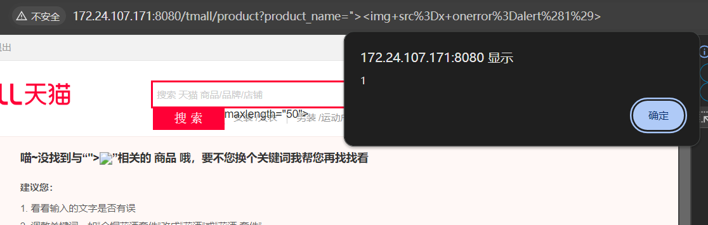

### src/main/java/com/xq/tmall/controller/fore/ForeProductListController.java

```java
    @RequestMapping(value = "product", method = RequestMethod.GET)
    public String goToPage(HttpSession session, Map<String, Object> map,
                           @RequestParam(value = "category_id", required = false) Integer category_id/* 分类ID */,
                           @RequestParam(value = "product_name", required = false) String product_name/* 产品名称 */) {
        logger.info("检查用户是否登录");
        Object userId = checkUser(session);
        if (userId != null) {
            logger.info("获取用户信息");
            User user = userService.get(Integer.parseInt(userId.toString()));
            map.put("user", user);
        }
        if (category_id == null && product_name == null) {
            return "redirect:/";
        }
        if (product_name != null && "".equals(product_name.trim())) {
            return "redirect:/";
        }

        logger.info("整合搜索信息");
        Product product = new Product();
        String searchValue = null;
        Integer searchType = null;

        if (category_id != null) {
            product.setProduct_category(new Category().setCategory_id(category_id));
            searchType = category_id;
        }
        //关键词数组
        String[] product_name_split = null;
        //产品列表
        List<Product> productList;
        //产品总数量
        Integer productCount;
        //分页工具
        PageUtil pageUtil = new PageUtil(0, 20);
        if (product_name != null) {
            product_name_split = product_name.split(" ");
            logger.info("提取的关键词有{}", Arrays.toString(product_name_split));
            product.setProduct_name(product_name);
            searchValue = product_name;
        }
        if (product_name_split != null && product_name_split.length > 1) {
            logger.info("获取组合商品列表");
            productList = productService.getMoreList(product, new Byte[]{0, 2}, null, pageUtil, product_name_split);
            logger.info("按组合条件获取产品总数量");
            productCount = productService.getMoreListTotal(product, new Byte[]{0, 2}, product_name_split);
        } else {
            logger.info("获取商品列表");
            productList = productService.getList(product, new Byte[]{0, 2}, null, pageUtil);
            logger.info("按条件获取产品总数量");
            productCount = productService.getTotal(product, new Byte[]{0, 2});
        }
        logger.info("获取商品列表的对应信息");
        for (Product p : productList) {
            p.setSingleProductImageList(productImageService.getList(p.getProduct_id(), (byte) 0, null));
            p.setProduct_category(categoryService.get(p.getProduct_category().getCategory_id()));
        }
        logger.info("获取分类列表");
        List<Category> categoryList = categoryService.getList(null, new PageUtil(0, 5));
        logger.info("获取分页信息");
        pageUtil.setTotal(productCount);

        map.put("categoryList", categoryList);
        map.put("totalPage", pageUtil.getTotalPage());
        map.put("pageUtil", pageUtil);
        map.put("productList", productList);
        map.put("searchValue", searchValue);
        map.put("searchType", searchType);

        logger.info("转到前台天猫-产品搜索列表页");
        return "fore/productListPage";
    }
```

​	The function implemented by this code is the product search function in the foreground, where the search parameters are product_name, and we can see from the audit that there is no additional processing of the product_name here, that is, there is no defense against XSS. Let's locate the frontend and construct the payload:

```html
">
```

​	Enter the search box and search.



​	Reflective XSS is triggered.